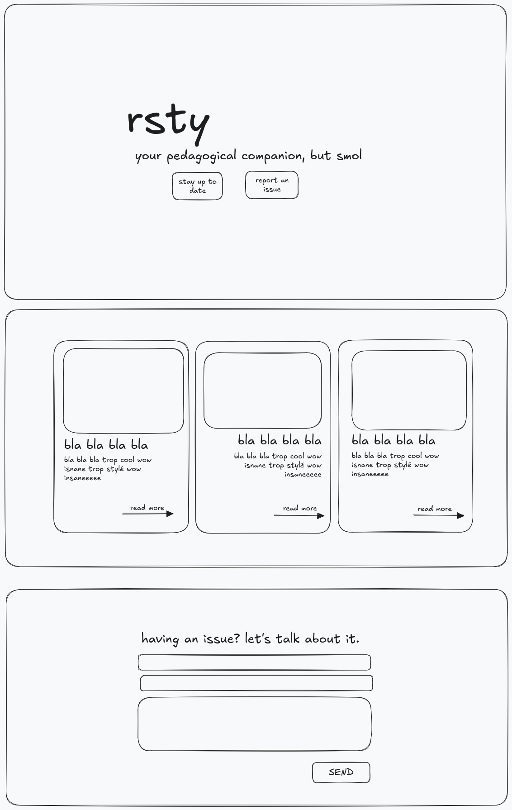

# rsty

> A test project for Dioxus frontend developement.

## Requirements

See [REQUIREMENTS.md](./REQUIREMENTS.md)

## Changes, what and why?

- [Nix support](./flake.nix)
  - Added support for Nix as a development shell provider, and (optionally) as a builder
    - This allows the project development/build steps to be fully deterministic and reproducible
    - Docker images can be easily added via the build configuration
  - Note: The Nix setup at 42 is buggy at best, this was mainly setup for development purposes
- Structuration
  - It's pretty unfinished, some components were left in their page's source file, and some pages were not implemented at all.
  - `pages` & `components` separation
  - `api` module, to isolate networking state from the rendering part

Website mockup (excalidraw.com)

  
## Encountered issues

- Losses of time. everywhere.
  - A huge loss of time on my end when trying to setup Nix and Dioxus at school, which was unbearably slow (see [nix#10683](https://github.com/NixOS/nix/issues/10683)).
  - A lot of panicking due to previously mentionned loss of time, thus more time lost.
  - Overall tooling (dioxus-cli/rust-analyzer) seem to be slow. Is this a known issue at 42? 
    - 
- Dioxus errors are not very helpful sometimes, which I expected from proc-macros, though quite robust most of the time.

I'm still pissed about the last commit that wasn't made on time, but I'll keep my frustration at [this comment](https://github.com/xtrm-en/ew2024-42a/commit/38f372b9909c6deefe1edb75b91bbc31219ffb48#r148961541).

## Final thoughts

This was a lot of fun, even if the end result isn't what I expected, I definitely saw too big for my level; even with some Rust experience, a new library to learn is still a big undertaking, especially when measuring your own expectations.

10/10 would fix rusty again. 